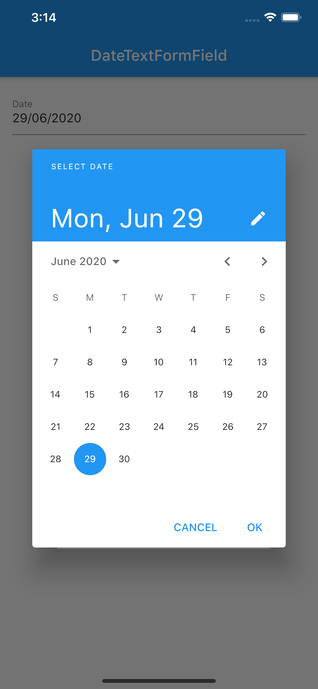
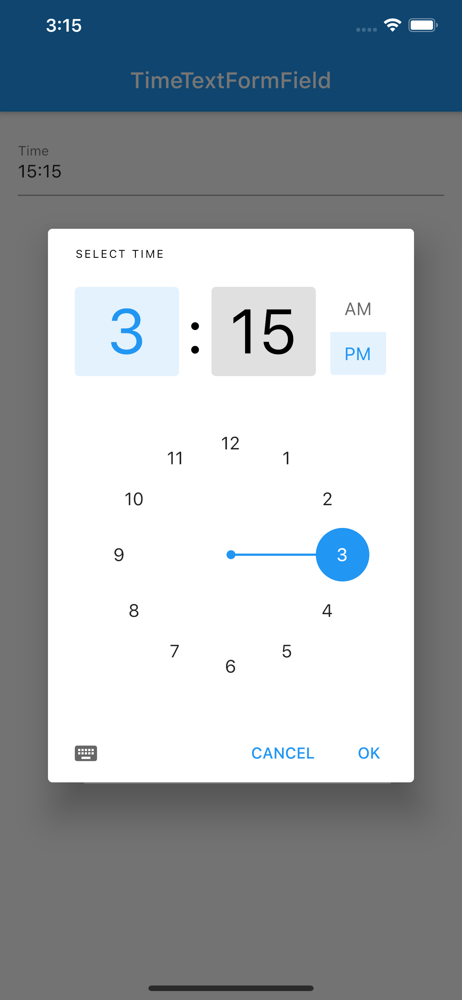

# date_time_text_form_field

A date and time picker form field. It support from operations such as validate, save and changed. You can change its display format by setting parameter format.

# Date

<strong>Como usar</strong>

DateTextFormField( &nbsp; &nbsp; decoration: null, //optional  &nbsp; &nbsp; value: null, //Default is DateTime.now(),  &nbsp; &nbsp; labelText: 'Date label',  &nbsp; &nbsp; onChanged: (DateTime value) {  &nbsp; &nbsp;&nbsp; &nbsp; print(value);  &nbsp; &nbsp; },  &nbsp; &nbsp; validator: null, //optional, );

# Time

<strong>Como usar</strong>

TimeTextFormField( &nbsp; &nbsp; decoration: null, //optional  &nbsp; &nbsp; value: null, //Default is TimeOfDay.now(),  &nbsp; &nbsp; labelText: 'Time label',  &nbsp; &nbsp; onChanged: (TimeOfDay value) {  &nbsp; &nbsp;&nbsp; &nbsp; print(value);  &nbsp; &nbsp; },  &nbsp; &nbsp; validator: null, //optional, );

